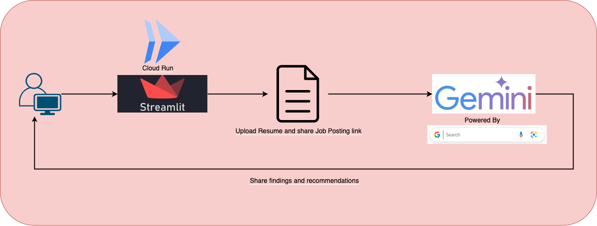

# CareerMatch AI 🎯

*From Resume to Results: How Google Gemini Powers Intelligent Career Matching*

An intelligent career matching platform that helps job seekers analyze their resume against job postings and get personalized job search recommendations using AI.



## Features

- **Resume Analysis**
  - Upload PDF resumes or paste resume text
  - Text extraction and processing from PDF files
  - Smart matching with job descriptions

- **Job Matching**
  - Calculate similarity scores between resumes and job postings
  - Analyze resume-job matches using Gemini Pro AI
  - Get detailed analysis of matching skills and missing requirements
  - Receive suggestions for resume improvement

- **Job Search Assistance**
  - Get AI-powered job search recommendations based on your resume
  - Find relevant job boards and active listings
  - Receive suggested search terms
  - Discover companies that might be hiring
  - Get industry insights for your skills in Australia

- **Cover Letter Generation**
  - Generate customized cover letters using AI
  - Based on your resume and target job posting

## Project Structure

```
job-seeker-assistant/
├── src/
│   ├── app.py              # Main application entry point
│   ├── config.py           # Application configuration
│   ├── job_analyzer.py     # Job analysis functionality
│   ├── job_searcher.py     # Job search functionality
│   ├── text_processor.py   # Text processing utilities
│   └── ui.py               # Streamlit UI components
├── requirements.txt        # Python dependencies
├── Pipfile                 # Pipenv dependencies
└── README.md               # This file
```

## Prerequisites

- Python 3.11+
- Google Cloud Project with following APIs enabled:
  - Vertex AI API
  - Gemini API

## Running CareerMatch AI locally

1. Clone the repository:
```bash
git clone <repository-url>
cd careermatch-ai
```

2. Install dependencies with either Pipenv or pip:
```bash
# Using Pipenv
pipenv install

# OR using pip
pip install -r requirements.txt
```

3. Set up Google Cloud Credentials

* Run [**_gcloud init_**](https://cloud.google.com/sdk/gcloud/reference/init) to authorize gcloud and other SDK tools to access Google Cloud using your user account credentials.

* Run [**_gcloud auth application-default login_**](https://cloud.google.com/sdk/gcloud/reference/auth/login) to obtain access credentials for your user account via a web-based authorization flow. When this command completes successfully, it sets the active account in the current configuration to the account specified. If no configuration exists, it creates a configuration named default.

4. Start the application:
```bash
export GOOGLE_CLOUD_PROJECT=$(gcloud config get-value project) && pipenv run streamlit run src/app.py
```

5. Open your browser and navigate to http://localhost:8501

6. Follow the on-screen instructions:
   - Upload your resume or paste resume text
   - Enter a job posting URL for specific job analysis (optional)
   - Click "Analyze" to get results
   - Optionally generate a cover letter for the job

## Technology Stack

- **Frontend**: Streamlit
- **AI/ML**:
  - Google Vertex AI
  - Gemini Pro for analysis and generation
  - Google's search capabilities for job recommendations
- **Additional Libraries**:
  - PyPDF2 for PDF processing
  - BeautifulSoup4 for web scraping
  - FastAPI for API framework

## Security & Privacy

- Resume data is processed securely and not stored permanently
- Uses Google Cloud's secure AI infrastructure
- All data processing happens within the session
- No personally identifiable information is stored

## Disclaimer

This tool uses AI to analyze resumes and job postings. Results are suggestions only and not guaranteed. Your data is processed securely but not stored. Always review AI-generated content before use in real applications.

## Contributing

Contributions are welcome! Please feel free to submit a Pull Request.

## Deploy on Cloud Run

[](https://deploy.cloud.run)

### If button goes to Cloud Shell Quota issue

Run the following on your Google Cloud Shell

```bash
cloudshell_open --repo_url "https://github.com/boltdynamics/careermatch-ai.git" --git_branch "main" --page "shell" --force_new_clone
```
